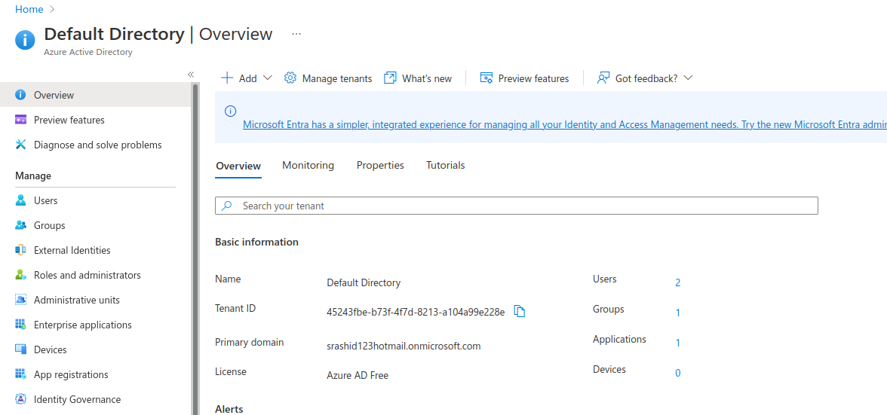
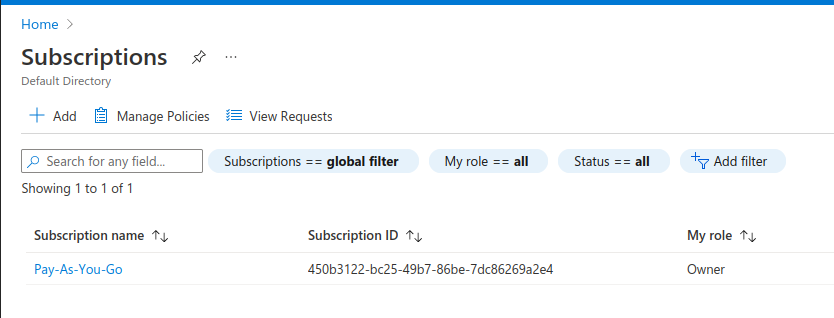
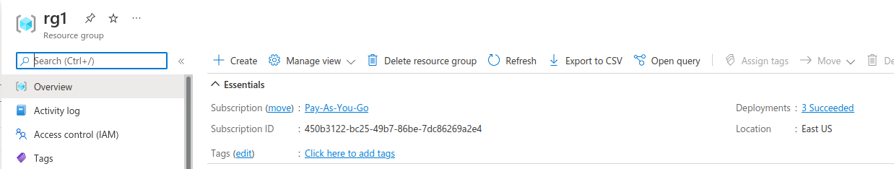
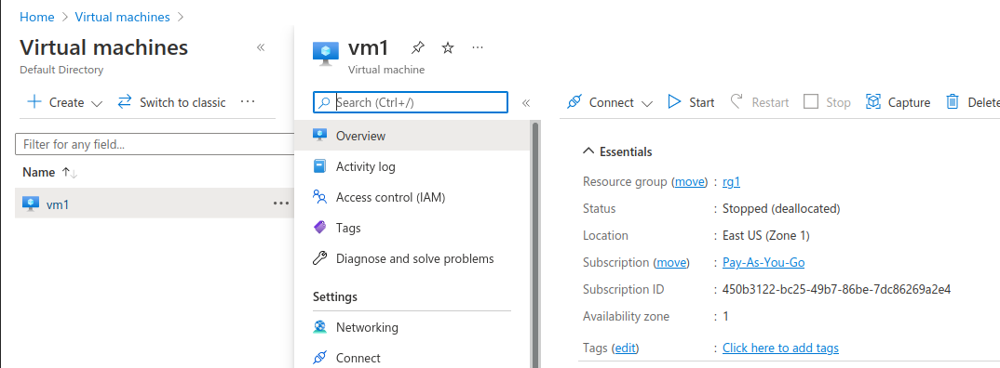
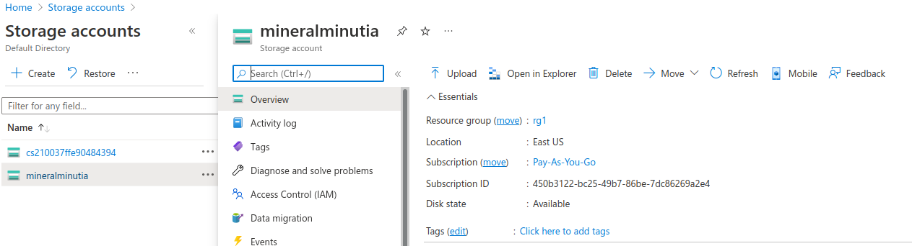
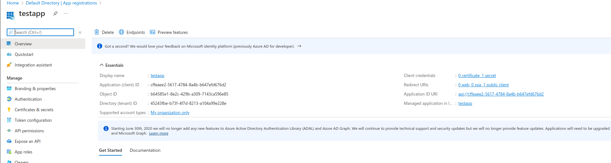
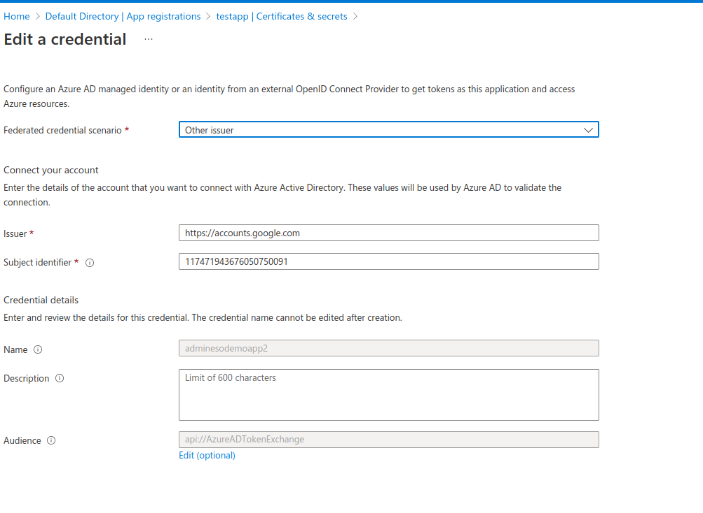
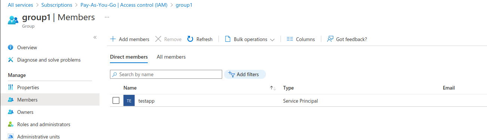
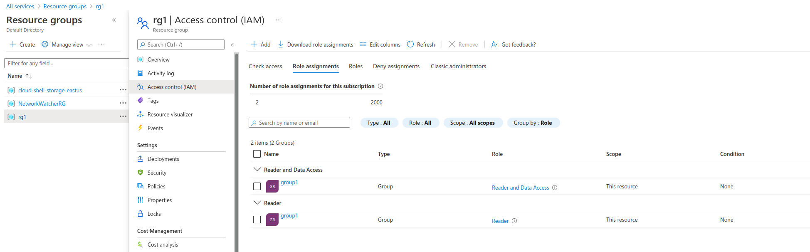

## Exchange Google and Firebase OIDC tokens for Azure STS

Tutorial and golang library that will federate a [google id token](https://github.com/salrashid123/google_id_token) token for Azure access tokens (**GCP Credentials --> Azure Resources**)

You can use this procedure to access azure resources directly from `Google Cloud Run`, `Cloud Functions`, `GCP VMs` or any other system where you can get a `google id_token`. 

This is the opposite of [Azure Credentials --> GCP resources](https://cloud.google.com/iam/docs/configuring-workload-identity-federation#azure) and basically uses [Azure Workload Identity Federation](https://docs.microsoft.com/en-us/azure/active-directory/develop/workload-identity-federation#how-it-works) to trust a google-issued `OIDC` token.  The final api call to azure will use an [access token request with a federated credential](https://docs.microsoft.com/en-us/azure/active-directory/develop/v2-oauth2-client-creds-grant-flow#third-case-access-token-request-with-a-federated-credential)

---

>> this repo is **not** supported by google

---

### References

* for **AWS Credentials --> GCP Resources** see [GCP Workload Identity Federation using AWS Credentials](https://github.com/salrashid123/gcpcompat-aws)
* for **GCP Credentials --> AWS Resources** see [Exchange Google and Firebase OIDC tokens for AWS STS](https://github.com/salrashid123/awscompat)
* for **Arbitrary OIDC Provider --> GCP Resources** see [GCP Workload Identity Federation using OIDC Credentials](https://github.com/salrashid123/gcpcompat-oidc)
* for **Arbitrary SAML Provider --> GCP Resources** see [GCP Workload Identity Federation using SAML Credentials](https://github.com/salrashid123/gcpcompat-saml)

---

First step is to configure federation trust between a GCP service account and Azure


### GCP Service Account

For the sake of simplicity, we will create a service account on GCP and _download_ a service account key. 

In practice, its *not* advisable to download an actual key (it has security risks there)...but since this is a tutorial, we can do this.

If you intend to run in cloud run, cloud functions, gke or gce vm (or on prem), you can use impersonation even abstract with workload federation


```bash

export PROJECT_ID=`gcloud config get-value core/project`

gcloud iam service-accounts create elevate --display-name "Federated Service Account"

gcloud iam service-accounts keys create svc_account.json --iam-account elevate@$PROJECT_ID.iam.gserviceaccount.com

gcloud auth activate-service-account --key-file=`pwd`/svc_account.json

export FEDERATED_TOKEN=`gcloud auth print-identity-token --audiences api://AzureADTokenExchange`
echo $FEDERATED_TOKEN
```

You can display the specifications of the oidc federated token by going to [jwt.io](jwt.io).  

Note the `sub` field we used (in my case its `117471943676050750091`).  That is the unique id which we will configure Azure to trust.

```json
      {
        "aud": "api://AzureADTokenExchange",
        "azp": "elevate@fabled-ray-104117.iam.gserviceaccount.com",
        "email": "elevate@fabled-ray-104117.iam.gserviceaccount.com",
        "email_verified": true,
        "exp": 1660052382,
        "iat": 1660048782,
        "iss": "https://accounts.google.com",
        "sub": "117471943676050750091"
      }
```


### Azure Tenant, Subscription and Resources

In this tutorial, we will start with

An `Azure Subscription` with resource group consisting of a `VM` and `Storage Container`. I'm assuming you would have already set this up.

From there we will [Use the portal to create an Azure AD application and service principal that can access resources](https://docs.microsoft.com/en-us/azure/active-directory/develop/howto-create-service-principal-portal)


note down the `id` and names for


- [tenant](https://docs.microsoft.com/en-us/azure/active-directory/develop/quickstart-create-new-tenant)



- [subscription](https://docs.microsoft.com/en-us/dynamics-nav/how-to--sign-up-for-a-microsoft-azure-subscription), vm and container i'll use are



- [resource_group](https://docs.microsoft.com/en-us/azure/azure-resource-manager/management/manage-resource-groups-portal)



- [vm name](https://docs.microsoft.com/en-us/azure/virtual-machines/linux/quick-create-portal)



- [storage account and container name](https://docs.microsoft.com/en-us/azure/storage/common/storage-account-overview)



### Federate GCP->Azure

With the azure resource and service acccount handy, we'll setup OIDC federation.

Google, as expected provides the standard well known endpoint oidc

* [https://accounts.google.com/.well-known/openid-configuration](https://accounts.google.com/.well-known/openid-configuration)


We will specify the issuer url when we configure Azure next


On the azure console under `Azure Active Directory` register a new app as described [here](https://docs.microsoft.com/en-us/azure/active-directory/develop/howto-create-service-principal-portal).


Select `App Registration` -> (`Accounts in this organizational directory only (Default Directory only - Single tenant)`).   I named my app `testapp`

Note down the `ID Values` for the app registration




Now select the `Client credentials` link and then create a new`Federated Credentials` with the specifications:



Specifically, set the issuer to `https://accounts.google.com/` (you don't need to specify the well known path since its..well, well known)

Critically, the subject is the unique identifier for the service account on Google's side that is specified in the oidc token presented.  In my case, its `117471943676050750091` 


Create an Azure Group and add this appID as a member




Finally, add IAM permissions to this group (i set the permissions at the resource_group level).  The two roles i used were : `Reader` and `Reader and Data Viewer`:



---

thats a lot of steps but w'ere finally ready to login.  


The `-u` value below is the `TenantID` value you created.  The tenant value is the domain for the tenant and in my case is `srashid123hotmail.onmicrosoft.com`


If all goes well, you should be logged in with a federated token and able to list the VM's and any blobs in the container


```bash
az login   --service-principal \
    -u cffeaee2-5617-4784-8a4b-b647efd676d2  \
    --federated-token $FEDERATED_TOKEN --tenant srashid123hotmail.onmicrosoft.com --allow-no-subscriptions --output table

CloudName    HomeTenantId                          IsDefault    Name           State    TenantId
-----------  ------------------------------------  -----------  -------------  -------  ------------------------------------
AzureCloud   45243fbe-b73f-4f7d-8213-a104a99e228e  True         Pay-As-You-Go  Enabled  45243fbe-b73f-4f7d-8213-a104a99e228e


$ az storage blob list     --account-name mineralminutia    --container-name mineral-minutia  --output table --only-show-errors
Name    IsDirectory    Blob Type    Blob Tier    Length    Content Type         Last Modified              Snapshot
------  -------------  -----------  -----------  --------  -------------------  -------------------------  ----------
go.mod                 BlockBlob    Hot          21        application/xml-dtd  2022-08-08T13:45:44+00:00


$ az vm list --output table
Name    ResourceGroup    Location    Zones
------  ---------------  ----------  -------
vm1     RG1              eastus      1
```


>> The federated token `az` uses in the samples above (`FEDERATED_TOKEN`) will expire in an hour. While the azure cli uses its own derived token using federated token, that too has an expiration date/time. This means that the `az` client will stop working in an hour or so since it has no idea how to ask for a new federated login token. The better way here is to request a new federated token and use that as shown below outside of a cli. The go library contained in this repo will also refresh using a new federated token for you so that step is take care of; its just an issue while using the az cli)


You can also use the raw curl to access the resource (eg compute; storage i came to find out is much more complicated)
```bash

export TENANT="srashid123hotmail.onmicrosoft.com"
export CLIENT_ID="cffeaee2-5617-4784-8a4b-b647efd676d2"
export FEDERATED_TOKEN=`gcloud auth print-identity-token --audiences api://AzureADTokenExchange`

curl -s https://login.microsoftonline.com/$TENANT/oauth2/v2.0/token \
--data-urlencode "client_assertion_type=urn:ietf:params:oauth:client-assertion-type:jwt-bearer" \
--data-urlencode "grant_type=client_credentials" \
--data-urlencode "client_id=$CLIENT_ID" \
--data-urlencode "client_assertion=$FEDERATED_TOKEN" \
--data-urlencode "scope=https://management.core.windows.net/.default"

## export the token from the response above into the  AZURE_TOKEN env-var

$ curl -s -H "Authorization: Bearer $AZURE_TOKEN" \
    "https://management.azure.com/subscriptions/450b3122-bc25-49b7-86be-7dc86269a2e4/providers/Microsoft.Compute/virtualMachines?api-version=2022-03-01" | jq '.'
{
  "value": [
    {
      "name": "vm1",
      "id": "/subscriptions/450b3122-bc25-49b7-86be-7dc86269a2e4/resourceGroups/RG1/providers/Microsoft.Compute/virtualMachines/vm1",
      "type": "Microsoft.Compute/virtualMachines",
      "location": "eastus",
      "properties": {
        "vmId": "48296592-9898-4778-bcc2-cd4cefad74f1",
        "hardwareProfile": {
          "vmSize": "Standard_B1ls"
        },
        "storageProfile": {
          "imageReference": {
```

### golang library ("github.com/salrashid123/azcompat/google")

This repo also contains an azure-compatible library which will automatically acquire and use a google_id token, exchange it for an azure one and all as a go Credential object for the azure SDK.

To use this, import the library and specify the id values you used for the tenant, subscription, app registration client_id, etc 

```bash
import (
	azcompat "github.com/salrashid123/azcompat/google"
)

const (
	clientID = "cffeaee2-5617-4784-8a4b-b647efd676d2"
	audience = "api://AzureADTokenExchange"
	tenantID = "45243fbe-b73f-4f7d-8213-a104a99e228e"

	subscriptionID = "450b3122-bc25-49b7-86be-7dc86269a2e4"
	resourceGroup  = "rg1"
	vmName         = "vm1"

	containerName = "mineral-minutia"
	accountName   = "mineralminutia"
)

func main() {

	ctx := context.Background()

	//cred, err := azidentity.NewDefaultAzureCredential(nil)

	cred, err := azcompat.NewGCPAZCredentials(&azcompat.GCPAZCredentialsOptions{
		ClientID: clientID,
		Audience: audience,
		TenantID: tenantID,
	})


	client, err := armcompute.NewVirtualMachinesClient(subscriptionID, cred, nil)
```

edit `main.go` in this repo, set the google credential env var to the svc account key file and rn the program:
```bash
export GODEBUG=http2debug=2

export GOOGLE_APPLICATION_CREDENTIALS=`pwd`/svc_account.json

go run main.go
```


The sample tries to print the specs of the VM and then acquires the `StorageAccounts Key`.  It will use the keys to list blobs in the container.  I'm unsure if getting the access key via admin is the best way but its what i've read so far....

